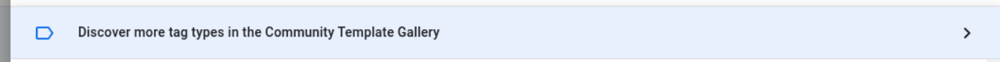
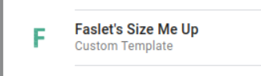
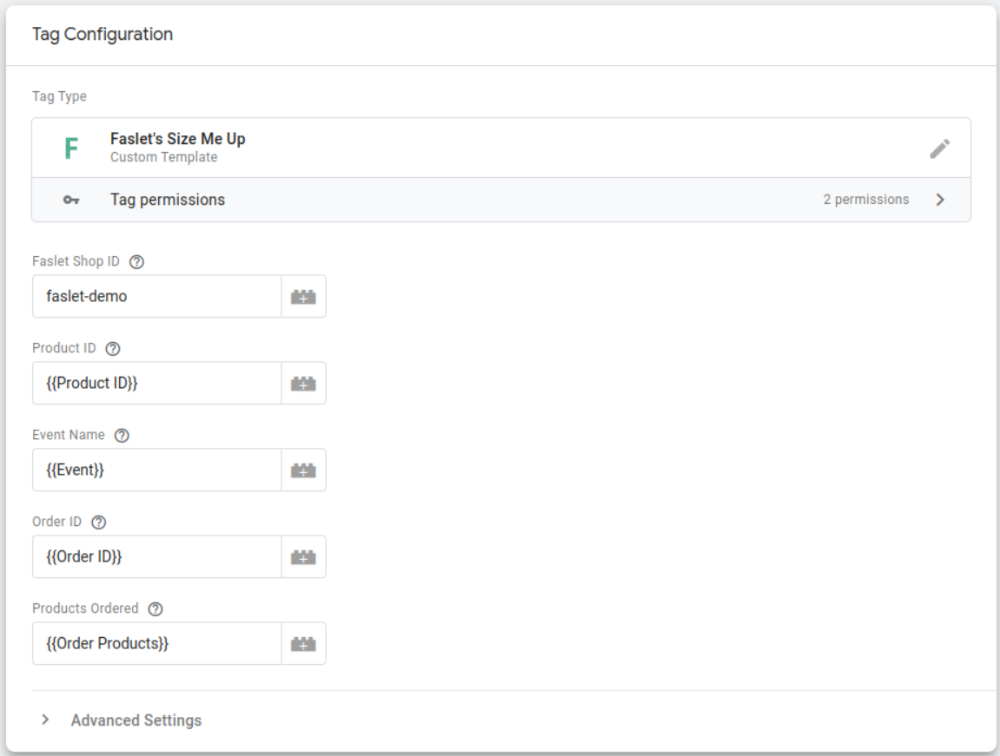
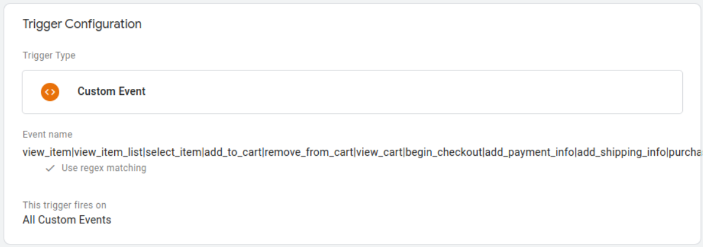
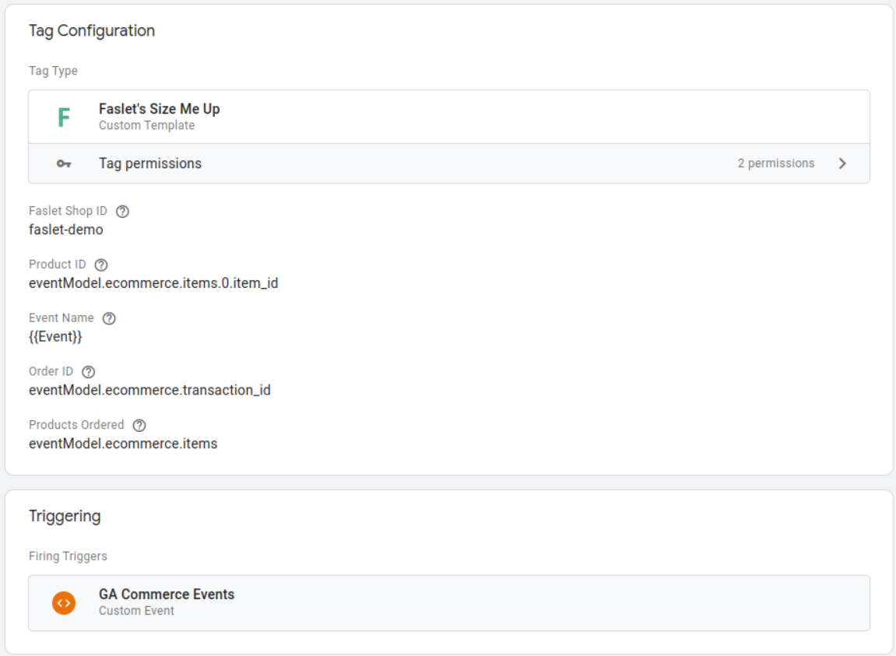

# Faslet Size Me Up for Google Tag Manager
The Faslet Size Me Up assistant for Google Tag Manager

## Sizing made simple with Faslet

Say goodbye to the guesswork and confusion of online sizing with Faslet. Our easy-to-use sizing solutions are designed with the customer in mind, making it simple to find the perfect fit every time.

## Requirements:

In order to use the GTM integration in your store, there are a few basic requirements:

1. You require a Faslet Account
2. You require access to your Google Tag Manager Account, to create Tags that are placed on your store
3. Google Tag Manager must be integrated into your store, on all pages
4. [Google Tag Manager ecommerce events](https://developers.google.com/analytics/devguides/collection/ga4/ecommerce?client_type=gtm) must be tracked, specifically _**view_item**_ and _**purchase**_ events are required
5. You should have provided Faslet with a Google Product Feed, validated by Faslet, which includes Product Identifiers that match the ones given to Google Tag Manager

If you meet all of the above requirements, it is possible to use Google Tag Manager to add Faslet's Size Me Up assistant to your web shop!
To get started, get in touch with your [Faslet Representitive](mailto:sales@faslet.me) and we will help you get set up!

## Integrating via Google Tag Manager

In Google Tag Manager, create a new Tag, and select the option to browse the Community Template Gallery:



Search for Faslet, and select the Faslet Size Me Up assistant:


Once selected, configure the Faslet Tag:
 


The fields should be filled in as follows:

| Field | Description                                                                                                                                                                                                                                                                                             |
| --- |---------------------------------------------------------------------------------------------------------------------------------------------------------------------------------------------------------------------------------------------------------------------------------------------------------|
| Faslet Shop ID | Your unique Faslet Shop ID, this can be found in [the partner portal under the widget integration tab on your store](https://portal.faslet.net/retailer).                                                                                                                                               |
| Faslet Product ID | The variable on the _**view_item**_ event that provides the Product ID of the given product. This needs to match what has been provided to Faslet in the Product Feed. Normally this is refered to as the Item Group ID, and in most cases is something like _**eventModel.ecommerce.items.0.item_id**_ |
| Event Name | The name of the event that triggers the Faslet Tag. This should already be configured by Google Tag Manager and the value of **{{Event}}** should be sufficient                                                                                                                                         |
| Order ID | The variable on the _**purchase**_ event that references the order ID. In most cases, this is something like _**eventModel.ecommerce.transaction_id**_                                                                                                                                                  |
| Products Ordered | The variable on the _**purchase**_ event that references the products ordered. In most cases, this is something like _**eventModel.ecommerce.items**_                                                                                                                                                   |

If you are unsure about these variables, please [reach out to us at support@faslet.me](mailto:support@faslet.me)! We can help you work out which variables to use.

Once the Tag is configured, you can add a Trigger to the Tag. For this trigger, we recommend using a custom events trigger, that matches the same regex as the Google Tag Manager Ecommerce events, namely:
```regexp
view_item|view_item_list|select_item|add_to_cart|remove_from_cart|view_cart|begin_checkout|add_payment_info|add_shipping_info|purchase
```

Your custom trigger should look like this:


The end result should look something like this (in our case we've used variables for all the fields):


Once you have mapped out the variables, and added the trigger, you can save the Tag, and publish your changes to Google Tag Manager. 
At this point, let us know that you've activated the code, and we'll activate the assistant for your store.

:::tip
Make sure to run through the [integration checklist](/docs/widget/integration-checklist) and validate in the [Faslet Partner Portal](https://portal.faslet.net) that everything is working and all the required events are being sent.
:::

## Help

In case of any questions, please don’t hesitate to contact us on support@faslet.me